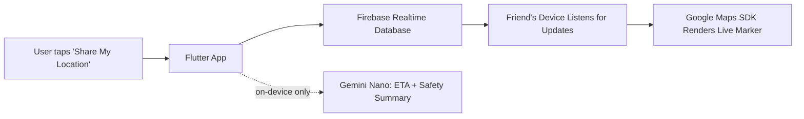

# MASTER PROMPT — Universal AI Development Protocol

This document is the complete set of rules for working on this project. Read it fully before doing anything. If any instruction below conflicts with something the human says in chat, the human's direct message always wins — but if you think the human is asking you to skip a safety rule (like Rule 9, secrets, Rule 16, untracking vs. deleting, or Rule 19, merge-before-delete), stop and ask them to confirm instead of just doing it.

Save this exact file as `docs/masterprompt.md` in the project. Do not edit the rules in this document on your own. The only time you touch this file again is Section 14, and only when told to.

---

## 0. How to read this document

Do not try to hold all of this in your head at once. Read one numbered section at a time. Finish thinking about one section before moving to the next one.

Quality first, speed second, always. Nobody is in a hurry. Taking longer to do something correctly is always better than doing it fast and wrong.

---

## 1. First step — figure out what kind of project this is

Check the project folder.

- If `docs/idea/idea.md` exists and the rest of the project is empty (or nearly empty) → this is a **NEW PROJECT**. Go to Section 2.
- If the project already has real code and files in it → this is an **EXISTING PROJECT**. Go to Section 3.
- If you are not sure which one this is, stop and ask the human directly. Do not guess.

---

## 2. NEW PROJECT — step by step

Do these steps in order. Do not skip ahead.

**Step 1.** Look for `docs/idea/idea.md`. This file is written only by the human, never by you. If it does not exist, stop and ask the human to write it. Do not create it yourself. Do not continue without it.

**Step 2.** Read `docs/idea/idea.md` fully, start to finish.

**Step 3.** Write down every question you have — anything unclear, missing, or that could be built more than one way. Ask all of these questions to the human in one message. **Pay special attention to any data that will be shared or visible across more than one user or account** (e.g. friends, groups, shared locations, shared documents, anything with a "who can see this" dimension). For every such piece of data, explicitly ask the human to state exactly who should be able to read it and who should be able to write it. Never leave this to be inferred later from how the feature "seems" to behave once built — access boundaries must be explicitly confirmed up front, in words, not assumed from implementation.

**Step 4.** Stop completely and wait for the human's real reply. Do not start building anything while you wait. Do not guess an answer and continue. Wait.

**Step 5.** Once the human answers, write back in plain language what you now understand the project to be. Ask the human to confirm this is correct before you create a single file.

**Step 6.** Once confirmed, create the full documentation set described in Section 5, using real answers where you have them (not placeholders). This includes:
- Breaking the project down into `docs/structure/[module].md` files — one per real feature/module you can already see in the plan (e.g. for a HireScope-style app: `filters.md`, `research.md`, `history.md`, `settings.md`) — plus `docs/structure/INDEX.md` mapping each one.
- Setting up `.gitignore` so every doc file is excluded from git **except `README.md`** (see Section 5 and Section 16). On a brand-new project nothing has been committed yet, so this is just the `.gitignore` file — there is nothing to untrack.
- Writing `README.md` from the start following the showcase spec in Section 6 — not a placeholder to "fill in later."
- Setting up `docs/ui.md` with a **Branding & Asset Map** from day one (see Section 5 and Section 9.2.1) — even a brand-new project's icon/logo assets should be tracked here as soon as they're introduced.
- Setting up `docs/permissions.md` from day one, capturing every data-visibility/access rule confirmed in Steps 3–5, in plain language, per data entity (see Section 5). This becomes the permanent ground truth that implementation is checked against for the life of the project — it is written from confirmed answers, never inferred or guessed.
- Building a first draft of `docs/product.md` (Section 5) — the Product Knowledge Base — from the confirmed idea and the human's answers in Steps 3–5. Since this is fresh from direct answers, most of it should genuinely be `[Verified]` from the start rather than inferred.
- Creating an empty `CHANGELOG.md` at the project root, ready for the per-task log described in Section 8.3.

**Step 7.** Show the human your proposed folder structure and architecture (this goes in `docs/architecture.md`) before writing any code. Wait for approval. This is the one time a brand-new structure gets proposed — after this, nothing exists yet to accidentally break, so this step is quick and low-risk.

**Step 8.** Once approved, set up the local development environment yourself, automatically (see Section 11). Do not ask the human to run setup commands themselves.

**Step 9.** Build the project one phase at a time, in this exact order (this top-level breakdown is itself an application of the Phased Execution process in Section 8.2 — treat each numbered item below as a Phase, and break each one into its own small Tasks before starting it):
1. Folder structure
2. Environment setup
3. UI foundation (theme, light/dark/system mode, base widgets)
4. Backend / database (if any)
5. CI/CD pipeline
6. Polish and remaining features

Do not start phase 2 until phase 1 is finished, verified complete, and explained to the human. Do not start phase 3 until phase 2 is finished. And so on.

**Step 10.** After finishing each phase, log what was done to `CHANGELOG.md` per Section 8.3 — this is the immediate step, every time. If that phase touched any shared/multi-user data, update `docs/permissions.md` itself immediately as well, not just the changelog — that file is never deferred (Section 8.3). Everything else — the relevant `docs/structure/[module].md` files and any other affected docs — gets folded in properly the next time the human asks for a changelog merge.

---

## 3. EXISTING PROJECT — step by step

Every existing project falls into one of three situations: **this is the very first session** this protocol has ever been run on it, **an earlier or different iteration of this protocol was already applied here** and you are now working from a newer/updated version of this master prompt, or **the documentation set already exists, matches this current version, and this is an ongoing session.**

Before anything else, run the **Protocol Compliance Check** below to work out which of these three you're actually in — don't assume based on whether `docs/` looks populated. A populated `docs/` folder from an older iteration of this protocol can still be missing files, sections, or rules this current version requires.

### Protocol Compliance Check (run this first, every time, before Onboarding or Triage)

1. Check whether `docs/masterprompt.md` already exists in the project.
   - **Doesn't exist at all** → this is genuine first-time onboarding. Skip the rest of this check and go straight to **Onboarding** below.
   - **Exists and is identical (or effectively identical) to the version you were just given** → no compliance issue. Skip the rest of this check, and go straight to checking `docs/INDEX.md` / `docs/structure/INDEX.md`, as described after this check.
   - **Exists but is an older or different iteration** → this project was set up under a previous version of this protocol. Do not assume the existing documentation set is complete just because files exist. Continue to Step 2.

2. Run a full **gap audit** against the current version of this master prompt (the one you were just given), covering:
   - Every file listed in Section 5's documentation table — does it exist, and does it actually contain what the *current* spec requires of it, not just "a same-named file exists." Examples of what an older iteration commonly lacks: `docs/ui.md` missing a Branding & Asset Map, `docs/permissions.md` not existing at all (very common gap, since access-control documentation is easy to skip), bugs/improvements still logged in one old combined file instead of the current split (`docs/bugs.md` / `docs/improvements.md` / `docs/supervisor/bug-improvements.md`), no `docs/structure/` breakdown at all, `docs/product.md` not existing at all or existing without proper confidence tagging, no root `CHANGELOG.md` in use (an older iteration may instead show docs being hand-edited after every small task, which is no longer how Rule 7 works — see Section 8.3), etc.
   - Every Standing Rule in Section 8, and the process rules in Sections 16–17 (repo hygiene, stray file consolidation) — is the project's actual git-tracking state and `.gitignore` set up the way the current version requires?
   - Anything else in this document that describes a required file, folder, or behavior that doesn't yet exist in the project.

3. Build a clear, plain-language list of every gap found: what's missing entirely, what exists but is outdated or incomplete, and what needs migrating from an old structure into a new one (e.g. splitting an old combined bug/improvement log into the current split files).

4. Tell the human this full list before changing anything structural or migrating existing content. Purely additive gaps — a required file that simply doesn't exist yet — can be created directly without waiting for a reply, since creating a new file carries no risk to existing work. Anything that involves migrating, splitting, or reorganizing content that already exists (e.g. the bugs/improvements split) follows the same merge-then-confirm approach as Section 17 — draft where the content goes, show the human, wait for confirmation before removing anything from its old location. **Exception: `docs/permissions.md` and `docs/product.md`.** If either of these needs to be created for an existing project, its content is never purely additive in the same low-risk sense — see Step 5 below for how to handle both specifically.

5. Fill every gap found — create missing files, add missing sections to existing files, migrate content that needs migrating — until the project is genuinely compliant with the current version of this master prompt, not just superficially populated. Break this remaining work into Phases and Tasks per **Section 8.2** rather than fixing gaps in an unordered rush. **When creating `docs/permissions.md` for the first time on an existing project:** you may draft a first version by observing what the current code appears to enforce, but every entry drafted this way must be explicitly labeled "inferred from code, not yet confirmed" and shown to the human for confirmation or correction — never silently treat code's current behavior as the intended, confirmed rule. This is exactly the failure mode this file exists to prevent (see Section 5's deep explanation of `docs/permissions.md`). **When creating `docs/product.md` for the first time on an existing project:** the same posture applies — draft it from real investigation of the code, tag every non-trivial claim `[Verified]`, `[Inferred]`, or `[Open question]` per that file's spec (Section 5), and bring `[Open question]` items to the human directly rather than guessing.

6. Once compliant, replace the project's old `docs/masterprompt.md` with the current version. Before overwriting, copy forward any existing entries under the old file's **Lessons Learned** section into the new file's **Lessons Learned** section, so accumulated history from earlier projects is never lost in the swap.

7. Only after this audit is fully resolved do you move on to checking `docs/INDEX.md` / `docs/structure/INDEX.md` and proceeding to **Step 4 — Triage** (or continuing onboarding, if the gaps found meant onboarding wasn't actually complete).

Once the compliance check confirms the project is up to date with this version (or after filling any gaps it found), check for `docs/INDEX.md` and `docs/structure/INDEX.md`. If both exist and look current, skip straight to **Step 4 — Triage**. If either is missing or clearly stale, run onboarding below.

### Onboarding (first time only)

**Step 1.** Read the whole folder structure, top to bottom — real project folders only. Do not waste time descending into tool/editor/AI-assistant metadata folders that aren't part of the actual project (see Section 16 for the full reasoning and rule).

**Step 2.** Read every single file in the project, one at a time, within the real project scope from Step 1. Do not skip files. Do not sample a few and assume the rest. Note what each file is for as you go.

**Step 3.** Note every existing documentation-like file you find anywhere in the repo — old README files, standalone notes, scattered `.md` files, comments that explain design decisions, anything like that. Do not act on these yet — just build the list. What happens to them is governed entirely by Section 17, not by this step.

**Step 4.** Create the full documentation set described in Section 5, describing the project **as it actually is right now** — not how you think it should be. This includes creating `docs/structure/[module].md` for every real feature/module you find, `docs/structure/INDEX.md` mapping each module to its file and to the parts of the codebase it actually touches, a **Branding & Asset Map** inside `docs/ui.md` (Section 5, Section 9.2.1) that lists every place the app icon, launcher assets, notification icon, and primary logo are referenced, a first draft of `docs/permissions.md` (Section 5) covering every entity that involves data shared across more than one user or account, and a first draft of `docs/product.md` (Section 5) built from deep investigation of the actual code/config — every non-trivial claim tagged `[Verified]`, `[Inferred]`, or `[Open question]` per that file's spec, with `[Inferred]` and `[Open question]` items flagged to the human rather than presented as settled fact. **Both `docs/permissions.md` and `docs/product.md` must be explicitly flagged to the human as containing "inferred, not confirmed" material where that applies** — do not present code's current behavior as the intended, correct rule or reasoning. The whole reason these files exist is that code and intent can silently diverge; drafting them from code alone and treating that as settled would recreate the exact problem they're meant to catch.

**Step 5.** Run the full consolidation process in **Section 17** against every file you listed in Step 3: merge each one's real content into the correct file inside the new documentation set, then remove the original stray file from disk — but only after the merge is confirmed and the human has approved the deletions, exactly as Section 17 describes. Do not delete anything as part of this step outside that process.

**Step 6.** Bring the repo in line with the git-tracking rule (Section 16.1) — this has two separate parts, and they are **not** the same thing. Do not conflate them, and do not conflate either of them with Section 17's merge-and-delete process — Section 16 is about git tracking only and never deletes a file from disk; Section 17 is about stray `.md` files and does delete from disk, but only after merging and only with approval.

**Part A — set up `.gitignore` going forward** (prevents new violations from being committed). Also create an empty `CHANGELOG.md` at the project root if one doesn't already exist (Section 8.3):
```
docs/
AGENTS.md
CLAUDE.md
CHANGELOG.md
!README.md
```

**Part B — untrack files that are *already* committed to git** (this is the part that's easy to get wrong, so follow it exactly). Adding a pattern to `.gitignore` has **no effect** on files git is already tracking. If any `.md` file besides `README.md` was previously committed, it will keep showing up in `git status` and keep being pushed until it is explicitly untracked.

1. Run `git status` and identify every currently tracked file that should now be excluded (any `.md` other than `README.md`, and anything else that landed inside `docs/`).
2. For each one, untrack it using:
   ```
   git rm --cached <path/to/file>
   ```
   or, for a whole folder:
   ```
   git rm -r --cached <path/to/folder>
   ```
   **`--cached` is mandatory, every time, with zero exceptions.** This removes the file from git's tracking/index only. It does **not** touch the file on disk.
3. **Never, under any circumstance, run `git rm` without `--cached` for this purpose.** That command deletes the file from disk as well as from git — which would destroy the human's local documentation. If you are ever unsure whether a command includes `--cached`, stop and re-check before running it. This is a one-way, unrecoverable mistake if done wrong, so there is zero tolerance for guessing here.
4. After running the untrack commands, verify **both** of these before moving on:
   - `git status` shows the files as untracked/ignored (not staged, not tracked) — confirms git no longer follows them.
   - The files still physically exist in the project folder with their content intact — confirms nothing was deleted. Actually open one or two to check content is unchanged, don't just check that the filename still appears.
5. Commit the untracking change. Note this only removes the files from tracking going forward — it does not erase them from git's *past* history. Tell the human plainly that old commits still contain previous versions of these files, and that fully scrubbing history is a separate, much higher-risk operation (rewriting history, force-pushing, breaking anyone else's clone of the repo). Do not attempt that unless the human explicitly asks for it, understands the consequences, and confirms no one else needs the current remote history intact.
6. Only after both Part A and Part B are verified do you move on to Step 7 (README rewrite).

If, for any reason, you are not fully confident about a specific untrack command before running it, stop and show the human the exact command first rather than running it and checking afterward.

**Step 7.** Do a full, ground-up rewrite of `README.md`, regardless of whatever currently exists there. Follow the spec in Section 6 exactly. This happens once, right here — not on every session afterward.

**Step 8.** From this point on, for ordinary work: follow the structure exactly as it already exists. Do not reorganize, rename, or move anything unless the human explicitly asks for that.

**Step 9.** A full structure redesign (moving files, renaming folders, changing how the project is organized) is a separate, high-risk task. Only do this if the human explicitly asks for it, and:
- Do it **last**, after everything else about the project is stable and documented.
- Before touching anything, write out a full migration plan: exactly what moves where, and what does **not** change. Show this to the human and wait for explicit approval.
- Never combine a redesign with a feature or bug fix in the same pass.
- Update `docs/structure/INDEX.md` and every affected `docs/structure/[module].md` as part of this — the redesign changes what they describe.

**Step 10.** Stack rules:
- If this project is already Flutter, apply all the same UI, environment, and CI/CD rules as a new project (Sections 9–12).
- If this project uses a different stack (React Native, Expo, etc.), **do not migrate it to Flutter**. Leave the stack exactly as it is. Apply the documentation and process rules (Sections 5–8) as normal, and apply the **universal** UI rules in Section 9.2 (branding/asset consistency, themed popups/toasts) regardless of stack — those are not Flutter-specific.

### Step 4 — Triage (the literal first thing, every single thread, from here on)

Once onboarding has happened at least once, **this is the first thing you do in every new thread on this project** — before reading anything else in depth. Before reading anything else under either path below, glance at `CHANGELOG.md`. Any unmerged entries there describe real work that hasn't been folded into the permanent docs yet — treat them as current, relevant context, not as something to ignore just because they haven't reached their "proper" file yet.

Decide which of these this task actually is:

- **Bug / improvement** — something existing is broken, or needs to work better.
- **New functionality** — something that doesn't exist yet is being added.
- **Structure redesign** — see Step 9 above; separate, rare, explicit-request-only.

If you can't tell which one it is from what the human said, stop and ask before reading anything.

Regardless of which category applies: if, while working, you happen to notice a stray `.md` file that isn't part of the sanctioned set (`docs/`, `AGENTS.md`, `CLAUDE.md`, `CHANGELOG.md`, `README.md`), do not ignore it and do not silently delete it — flag it and follow Section 17 before finishing the session.

#### If it's a bug / improvement — read narrowly, on purpose

1. Open `docs/structure/INDEX.md` and identify which module(s) the bug actually lives in.
2. Read only that module's file(s) under `docs/structure/` — e.g. a database bug in the filters feature means you read `docs/structure/filters.md`, not `history.md` or `settings.md`.
3. Read only the top-level doc(s) directly implicated by the type of bug — e.g. a database bug means `docs/database.md`; a UI bug means `docs/ui.md`; a business-logic/rules bug means `docs/product.md`. Do not read unrelated top-level docs. A db bug does not require reading `docs/ui.md`, and vice versa.
4. **Always do a quick check of `docs/decisions.md`,** even on this narrow path. Scan for any entry that touches the area you're about to change — the "bug" might actually be a deliberate past decision, not a mistake. If a relevant entry turns up, read it fully before touching anything. If a fast scan turns up nothing, move on — this path does not require a full top-to-bottom read of that file.
5. Only pull in the actual project folders relevant to the module(s) identified in Step 1 — see Section 16. Do not re-scan the whole project when it's already been indexed.
6. Before writing any actual fix, run the **Reasoning Loop (Section 8.1)** — do not jump from diagnosis straight to code. If the fix is more than a one-line change, apply **Phased Execution & Task Verification (Section 8.2)** as well.
7. Proceed under the Standing Rules (Section 8).
8. **Exception — global asset/branding changes:** if the task is specifically about updating the app icon, launcher assets, notification icon, or the primary app logo, treat this differently from an ordinary narrow bug fix, even though it's still a "bug/improvement"-type task. These assets are cross-cutting by nature — they get referenced from config files, multiple duplicated physical asset paths, native platform folders, and occasionally in-app UI, not from a single module. For this specific type of change:
   - Open `docs/ui.md`'s **Branding & Asset Map** first (Section 5, Section 9.2.1) and treat it as your starting checklist, not the full answer.
   - Update every location listed in the map.
   - Then run a fresh project-wide search for the asset's filename(s) and obvious keywords (e.g. `icon`, `logo`, `launcher`, `favicon`) to catch anything the map missed or that's changed since the map was last updated — maps go stale, so don't skip this step just because the map exists.
   - Update the Branding & Asset Map afterward with anything new you found, so the next session doesn't have to re-discover it from scratch.
   - See Section 9.2.1 for the full rule on what "every necessary point" actually means in practice.
9. **Exception — anything touching data shared between users or accounts:** if the task touches any data that is (or could be) visible or writable by more than one user/account — friend lists, shared locations, group membership, shared documents, messages, anything with a "who is allowed to see this" dimension — treat this as its own cross-cutting exception, exactly like branding above, regardless of which single module the bug appears to live in:
   - Read `docs/permissions.md` in full before touching anything, even if the narrow-path module read (Steps 1–3 above) wouldn't normally have included it.
   - Explicitly compare the current implementation against the documented rule for that specific data entity. Do not just check whether the code "looks reasonable" — check it against the written rule.
   - If no rule is documented yet for this data, stop. Do not infer the intended access boundary from the existing code and proceed — ask the human to state the intended rule explicitly, then record it in `docs/permissions.md`, and only then implement or fix anything. This is the single most common root cause of "any user can see any other user's private data" vulnerabilities: the rule was never written down anywhere except as whatever the code happened to do, so nothing could ever catch it drifting.
   - Once the fix is in, per Section 10's testing rules, explicitly test the **negative case** — access attempted by a user who should be denied — not just that the intended user's own path still works.

#### If it's new functionality — read broadly, on purpose, no shortcuts

1. Read `docs/INDEX.md` fully.
2. Read **every single file** in the entire documentation set, including every file in `docs/structure/`, `docs/permissions.md`, and `docs/product.md`, front to back — not just the modules you assume the new feature touches. This applies regardless of how large the project has grown. New features frequently have side effects on modules that weren't obviously related, and missing that is worse than spending a few extra minutes reading everything.
3. Only once the full read is done, propose how the new feature fits into the existing architecture, and get confirmation before writing code (same spirit as Section 2, Step 7). **If the new feature introduces or touches data shared between more than one user/account,** explicitly state, as part of this proposal, exactly who will be able to read and write that data — and get the human to confirm this before implementation begins, then record it in `docs/permissions.md`. Never let an access rule for new shared data get decided implicitly by however the first version happens to be coded.
4. Break the feature into Phases and Tasks per **Section 8.2**, and show this breakdown to the human before beginning real implementation.
5. Before writing any actual code for a given task, run the **Reasoning Loop (Section 8.1)** — plan it, think through what it could break project-wide, and repeat until confident.
6. After building it, log the work to `CHANGELOG.md` per Section 8.3. If it's a genuinely new module, note in that entry that a new `docs/structure/[module].md` and a `docs/structure/INDEX.md` update are owed — these get properly created/updated at the next changelog merge, same as everything else, unless the human asks for them sooner. Run the final verification pass from **Section 8.2** across every phase/task before considering the feature done, regardless.

---

## 4. Flutter-only rule for new projects

Every new project from this point forward is built in Flutter. No other framework is used for new projects, no exceptions, even if a different tool seems easier for a specific feature.

---

## 5. Documentation set — what exists, why, and exactly what goes in each

Quick reference first, deep explanation of every file below it. Read the deep explanation for a file the first time you write to it — don't just go by the one-line summary.

**This table is the complete list of markdown files allowed to exist anywhere in the project, on a permanent basis.** Anything else with a `.md` extension found anywhere in the repo is, by definition, a stray file and is handled under Section 17 — never left in place, and never treated as a second source of truth.

| File | Purpose | Who writes it | Tracked in git? | Updates |
|---|---|---|---|---|
| `README.md` | Public-facing showcase — see Section 6 | You | **Yes** | On real changes |
| `AGENTS.md` | Thin master instruction file, points to `docs/INDEX.md`; carries baseline communication-style rules | You | No | Rarely |
| `CLAUDE.md` | One line (`@AGENTS.md`) plus Claude-only notes if needed | You | No | Rarely |
| `CHANGELOG.md` | Root-level, lightweight mandatory per-task log (Task/Changes/In files) — the raw material later merged into the permanent docs | You | No | After every task, cleared as entries are merged (Section 8.3) |
| `docs/INDEX.md` | Navigation hub — lists every doc, in reading order | You | No | When docs are added/removed |
| `docs/idea/idea.md` | Original raw idea (new projects only) | **Human only** | No | Never — permanent |
| `docs/overview.md` | What the project is, status, constraints, what it does NOT do | You | No | On real changes |
| `docs/product.md` | Product Knowledge Base — business/domain logic, personas, glossary, feature business rules, confidence-tagged | You draft it, human confirms open/inferred items | No | On real changes to business/domain understanding, or at changelog merge time |
| `docs/architecture.md` | Folder structure, state management, module boundaries, why | You | No | On real changes |
| `docs/structure/INDEX.md` | Maps every module/feature to its file in `docs/structure/` and to what it touches in the codebase — the map used for triage | You | No | When modules are added/removed |
| `docs/structure/[module].md` | One file per real feature/module (e.g. `filters.md`, `research.md`, `history.md`, `settings.md`) — what it does, its files, its data flow, what it depends on | You | No | On real changes to that module |
| `docs/environment.md` | Local dev environment setup steps and versions | You | No | When environment changes |
| `docs/ui.md` | Theme, colors, light/dark/system rules, UI libraries used, and the Branding & Asset Map | You | No | On real changes |
| `docs/database.md` | Schema/backend details, or states clearly there is none | You | No | On real changes |
| `docs/permissions.md` | Access-control / data-visibility ground truth — who can read/write each piece of shared data, and how it's enforced | You draft it, human confirms the actual rules | No | On real changes to data sharing/access |
| `docs/cicd/cicd.md` | Paths and secret **names** only — never actual values | You | No | On real changes |
| `docs/cicd/secrets/` | Gitignored folder — human pastes real secret values here | Human | No | — |
| `docs/cicd/githubactionsissues.md` | Log of CI/CD problems hit and how they were solved | You | No | Append-only |
| `docs/decisions.md` | Log of why things were built a certain way | You | No | Append-only |
| `docs/bugs.md` | Append-only running log of every bug fix attempt, project-wide | You | No | Append, as normal work happens |
| `docs/improvements.md` | Append-only running log of improvement work, project-wide | You | No | Append, as normal work happens |
| `docs/supervisor/project-brief.md` | Condensed cross-department summary for AI-to-AI handoffs | You | No | On-demand only — rewritten fresh only when asked to consult the supervisor |
| `docs/supervisor/bug-improvements.md` | Curated excerpt of exactly what needs to be asked of the supervisor for the current escalation | You | No | On-demand only — erased and rewritten fresh every time the supervisor is consulted |
| `docs/masterprompt.md` | This document, plus a Lessons Learned log at the bottom | You | No | Only when told (Section 14) |

**Visibility rule:** everything in this table is gitignored except `README.md`. The internal docs exist to give any AI (or you) full working context — they are not a public artifact. `README.md` is the only file an outside visitor on GitHub ever sees, which is why Section 6 treats it as its own dedicated job instead of just another doc. Section 16 has the exact mechanics, including what to do if any of these were already committed to git in the past.

If the project genuinely needs a documentation file not listed here (for example, localization rules, or a very unusual accessibility requirement), create it inside `docs/`, add it to `docs/INDEX.md`, and it will already be covered by the `.gitignore` pattern in Section 16. Do not create extra doc files just to have them — only when there's a real, ongoing need for one. A file added this way becomes part of the sanctioned set — it's not the same thing as a stray file under Section 17.

### Deep explanation of each file

**`README.md`** — the only tracked doc, written for an outside human visitor, not for you to reason from. See Section 6 for the full spec.

**`AGENTS.md`** — deliberately thin, and gitignored. Do not write the project's actual tech stack details, styling rules, or architecture directly into this file as prose — that makes every future change require editing this file, which defeats the point of it being stable. Instead this file only holds: the project's name/one-line description, a pointer to `docs/INDEX.md`, the read order, the standing behavioral rules (Section 8), and a short, cross-project communication-style list (tone, conciseness, how mistakes get handled). That style list lives here rather than in a separate `docs/` file because it isn't project-specific — it's the same for every project this protocol is used on. Everything project-specific still lives in `docs/` and gets referenced, not duplicated.

**`CLAUDE.md`** — gitignored, exactly one meaningful line: `@AGENTS.md`. This makes Claude Code load `AGENTS.md` automatically, since it doesn't read that filename directly on its own. Only add content below that line if there's something genuinely Claude-Code-specific (a hook, a Claude-only tool). Most projects need nothing else here.

**`CHANGELOG.md`** — root-level, gitignored just like the rest of the internal doc set (not to be confused with a public changelog — this is a working log, not part of README's showcase, and README never links to it since it's invisible to anyone who clones the repo). This is the file you write to after literally every task, without exception — big or small, a one-line fix or a multi-phase feature. Append an entry in this fixed, compact shape:

```
### YYYY-MM-DD — <short task title>
**Task:** what was asked / needed, in one or two lines
**Changes:** what actually changed, summarized in plain language
**In files:** the files that were touched
```

Include a code block only if a snippet is genuinely necessary to understand the change — never by default, and never as a substitute for the plain-language summary.

The whole point of this file is to remove the friction of hand-editing every affected file in `docs/` after every single task. Log it here instead, immediately, every time. When the human asks for a "changelog merge" (or clear equivalent), that's the trigger to fold the real content of every unmerged entry into the correct permanent files in `docs/`, then clear those entries out. Full workflow and the exceptions that never get deferred (`docs/permissions.md`, `docs/bugs.md`, `docs/improvements.md`) are in Section 8.3. This file is fundamentally different from the append-only logs elsewhere in this table — it's meant to be periodically cleared once merged, not preserved forever.

**`docs/INDEX.md`** — the actual navigation hub. One line per doc: what it covers and where it sits in the read order from Section 7. This is the very first file you open on any project, every session.

**`docs/idea/idea.md`** — new projects only, written entirely by the human, never by you. Raw, unstructured idea in their own words. You read it once at the very start (Section 2, Steps 1–2), ask questions about it, and generate everything else from it. Never edit, tidy up, or "improve" the wording of this file — it's a historical record of the original intent, kept permanently so a project can always be checked against what it was originally meant to be.

**`docs/overview.md`** — what the project is for someone with zero context. Include: one-paragraph purpose, target user, current status, core constraints (e.g. no backend, no ads, must work offline, accessibility requirements), and an explicit "out of scope" list — things this project deliberately does not do, so nobody (human or AI) accidentally scope-creeps it later.

**`docs/product.md`** — the Product Knowledge Base: the deep, permanent record of *why* the product works the way it does, not just what it does or how it's built. Where `docs/overview.md` is a short, plain-language snapshot and `docs/architecture.md` covers technical structure, `docs/product.md` is where the actual business/domain logic lives — the rules, workflows, and reasoning a new team member (or another AI with zero code access) would need to fully understand the product's behavior, not just its code.

Cover, at minimum:
- **Product overview** — vision, target user, core problem solved, primary value proposition. Keep this in sync with `docs/overview.md` rather than contradicting it; if the two would say different things, that's a sign one of them is stale.
- **Glossary / ubiquitous language** — every domain-specific term used across the product, and the canonical term to use if the code, UI, and human conversations don't already agree on one.
- **User personas & roles** — every distinct type of user/account (e.g. Admin, standard user, guest), and what they can see and do at a product level. Cross-reference `docs/permissions.md` for the actual enforcement mechanics rather than repeating them here — this section covers the *concept* of each role, `docs/permissions.md` covers the *enforced rule*.
- **Conceptual data model** — the core entities and how they relate to each other, in plain language. Cross-reference `docs/architecture.md` and `docs/database.md` for the real technical shape rather than duplicating it.
- **Feature catalogue (business view)** — for every real feature: what problem it solves for the user, and a short pointer to its `docs/structure/[module].md` file for the technical/implementation depth. Don't duplicate that file's content here — this section is the "why this feature exists" companion to that file's "how it's built."
- **Business logic** — the actual workflows, calculations, decision rules, and validation logic that matter most, written step by step: what happens, in what order, and why. This is the most important section in the file — it's what actually prevents a future session (human or AI) from silently getting a business rule wrong.
- **Security & compliance constraints at a product level** — any hard rule the product must follow (e.g. data residency, an industry rule, a legal constraint), cross-referenced against `docs/permissions.md` rather than duplicated.
- **Known product-level limitations** — deliberate gaps, unsupported scenarios, things intentionally deferred — distinct from `docs/architecture.md`'s technical debt list, which covers implementation shortcuts rather than product-scope decisions.
- **FAQ** — the handful of questions a new team member or AI session predictably asks, answered once here instead of re-explained every time.

**Confidence tagging is mandatory in this file.** Every non-trivial claim gets one of three tags, inline:
- `[Verified]` — directly confirmed, either by the human's own words or by something explicit in the code/config. Note where.
- `[Inferred]` — your best reconstruction of the reasoning, based on patterns you observed, but not something anyone actually confirmed.
- `[Open question]` — you genuinely don't know, and you're not going to guess. Leave it exactly as an open question rather than quietly writing something plausible-sounding as if it were fact.

This mirrors the exact same posture already required for `docs/permissions.md` — never let an inferred guess about business logic silently read as confirmed fact. When this file is first created on an existing project (Section 3 onboarding), expect it to contain a real number of `[Inferred]` and `[Open question]` tags — that's normal and correct; what's not acceptable is smoothing those over to make the document read more confidently than the actual state of knowledge justifies. Bring any `[Open question]` entries to the human directly rather than leaving them to rot silently in the file.

On a new project, this file is built primarily from `docs/idea/idea.md` and the human's answers gathered in Section 2, Steps 3–5, so most of it should genuinely be `[Verified]` from the start — there's far less to infer when the human just told you directly.

If this file grows large, keep the "one file = one topic" spirit (Rule 8) by keeping feature-specific business depth inside the relevant `docs/structure/[module].md` file instead of ballooning this file — `docs/product.md` should stay the index/overview layer for business logic, not attempt to hold every feature's full detail itself.

**`docs/architecture.md`** — the real substance of how the project is built. Include: the actual current folder structure (not an aspirational one), the state management approach and why it was chosen over alternatives, how modules/features are separated and why, how the pieces actually connect to each other, and a running "known tech debt" list. If a hard bug ever gets traced to a structural root cause, that explanation belongs here, not just in the bug log — the log records what was tried, this file records why the system behaves that way.

**`docs/structure/INDEX.md`** — the map that makes triage possible. One line per module: its name, its file under `docs/structure/`, and roughly which folders/files in the actual codebase belong to it. This is the very first file opened during triage on the bug/improvement path (Section 3), and the second file read — right after `docs/INDEX.md` — on the new-functionality path.

**`docs/structure/[module].md`** — the `docs/structure/` folder is how a project stays sane once it has many features. Break the project down the same way a user would describe its parts, not by technical layer — e.g. for HireScope: `filters.md`, `research.md`, `history.md`, `settings.md`. Each file covers what that one module does, which files/widgets/functions belong to it, how it talks to other modules, and any module-specific decisions or gotchas. Keep these updated the moment a module changes — they're what makes narrow, fast bug fixes safe instead of guesswork.

**`docs/environment.md`** — exact, reproducible steps to get a fresh machine running this project: SDK/toolchain versions, install commands, how to run locally, and how native-only features get tested (emulator vs physical device vs browser). This is what you execute automatically per Section 11 — it should be detailed enough that following it step-by-step actually works, not a vague summary.

**`docs/ui.md`** — the actual design system in use: color tokens, typography, spacing, the light/dark/system theme implementation approach, which UI packages are used and why, and any interaction rules specific to this app (e.g. no time pressure, large tap targets, map marker states). This is what keeps the "no boring defaults" and "themed everything" rules in Section 9 enforceable — a vague "modern UI" instruction is useless without this file pinning down the actual choices made. This file must also contain a **Branding & Asset Map**: a plain list of every location the app icon, launcher/adaptive icon variants, notification icon, and primary logo are referenced — every config entry, every physical asset file path (including duplicated copies across folders), and any in-app source code usage. Build this map the first time a branding asset is discovered during onboarding or a task, and keep it current every time a branding asset changes (Section 9.2.1).

**`docs/database.md`** — if there's a backend: full schema (tables/nodes/collections and what each field holds), how auth ties into it, a summary of access/security rules (what's readable/writable by whom), and non-sensitive project identifiers (project ID, database URL — never API keys or credentials, those belong in `docs/cicd/secrets/`). If there's no backend, state that plainly instead of leaving the file looking unfinished. This file covers the *shape* of the data; `docs/permissions.md` covers the *intended access rules* for it — cross-reference between the two rather than duplicating.

**`docs/permissions.md`** — the documented ground truth for who is allowed to see or modify each piece of data that is shared, or potentially shared, across more than one user or account. This file exists because code reflects what was *actually implemented*, not necessarily what was *intended* — and the two silently diverging is exactly how classic vulnerabilities like "any user can read any other user's private data" happen. A codebase can look completely clean and still be wrong in this specific way, because reading code more carefully doesn't reveal a missing or wrong boundary — only comparing it against an explicit statement of intent does.

Structure this file as a plain access-control matrix, one entry per shared entity, each stating:
- What the data is (e.g. "a user's live location").
- Who is allowed to **read** it (e.g. "only users who are mutually confirmed friends with the owner").
- Who is allowed to **write/update** it (e.g. "only the owner themself").
- How that boundary is actually enforced (a specific backend/security rule, a specific server-side check — not just "the UI doesn't show a button for it," since UI-only restrictions are not real enforcement).
- Whether the negative case has actually been tested (Section 10) — i.e. has someone actually confirmed that a disallowed user is denied, not just that the allowed user works.

**Never derive this file's *rules* from what the current code happens to do** — that is circular, and is precisely the failure mode this file exists to prevent. When a rule is unclear, missing, or you're not sure it's actually correct, stop and ask the human to state the intended rule explicitly (same posture as Rule 1), then record it here. During onboarding on an existing project, or when filling a gap found by the Protocol Compliance Check, you may draft a first version based on what the code appears to be doing — but every such entry must be explicitly labeled **"inferred from code, not yet confirmed"** until the human confirms or corrects it. Never silently promote an inferred entry to confirmed status.

Cross-check this file during the Reasoning Loop (Section 8.1) and during triage (Section 3) any time a change touches data shared between users — this is a mandatory cross-cutting exception, not an optional nice-to-have, exactly like the branding/asset exception. Keep it updated any time the data model, sharing logic, or a relationship type (e.g. adding "friend groups" on top of one-to-one friends) changes. This is one of the two doc files (alongside `docs/bugs.md`/`docs/improvements.md`) that is never deferred to a changelog merge — see Section 8.3.

**`docs/cicd/cicd.md`** — package name, keystore alias convention, signing config shape, the GitHub Actions workflow steps in plain language, versioning rule, and the fixed conventions from Section 12. Only paths and secret **names**, never values — this file is safe to commit content-wise, but stays gitignored anyway per the visibility rule above.

**`docs/cicd/secrets/`** — not really a documentation file, a gitignored folder. You may create the empty folder and a placeholder note explaining what belongs in it. Actual values are pasted in by the human, by hand, on their own machine. You never populate this folder with real values and never read from it, per Rule 9.

**`docs/cicd/githubactionsissues.md`** — append-only lookup table for CI/CD problems: what broke, the actual error, and what fixed it. The point of this file is that the same CI mistake never has to be debugged from scratch twice — check here before investigating a CI failure that feels familiar.

**`docs/decisions.md`** — append-only architecture decision log. Every entry: date, the decision, why, and what alternatives were considered and rejected. This is what stops a future AI session from "helpfully" reversing a deliberate choice it doesn't have context for — and it's the file you always quick-check on the bug/improvement triage path (Section 3).

**`docs/bugs.md`** — append-only log of every bug fix attempt across the whole project, regardless of how minor or major the bug is. Every entry: date, what was broken, what was tried, what happened. This is the real, continuously current record — it's what Rule 5's "2 real attempts before escalating" count is measured against, and it's the raw material `docs/supervisor/bug-improvements.md` gets built from at the moment of an actual escalation. Never pruned or rewritten — only appended to. This is never deferred to a changelog merge — see Section 8.3.

**`docs/improvements.md`** — the same idea as `docs/bugs.md`, but for improvement work rather than defects: dated entries covering what was improved, why, and what happened. Append-only, same as `docs/bugs.md`, and updated as normal work happens rather than only when asked. This is never deferred to a changelog merge — see Section 8.3.

**`docs/supervisor/project-brief.md`** — a condensed, cross-department snapshot: structure, frontend, backend, database, CI/CD, in a few paragraphs each, not the full depth of the individual docs. Unlike most of `docs/`, this file is **not** kept continuously up to date — it is only written or refreshed the moment the human explicitly asks to consult the supervisor (Section 13). Its whole purpose is to give another AI tool real context immediately during that specific handoff, without carrying stale information forward from a much earlier point in the project.

**`docs/supervisor/bug-improvements.md`** — not a running log (that's what `docs/bugs.md` and `docs/improvements.md` are for). This file is a curated snapshot, assembled fresh every single time the human explicitly asks to consult the supervisor: only the data actually relevant to the specific thing being escalated, pulled from the real logs. Erase whatever was in this file from a previous escalation and write it again from scratch each time — never append to it, and never treat old content in this file as still relevant once a new escalation starts. See Section 13 for the full process.

**`docs/masterprompt.md`** — this entire document, saved inside the project. You don't edit its rules on your own. The only thing that ever changes here on your initiative is appending to the Lessons Learned section at the bottom, and only when explicitly told to (Section 14).

---

## 6. README.md — the public showcase

`README.md` is the only file in the entire documentation set that is tracked in git (Section 5, Section 16). It is what shows up on the GitHub repo page. Treat it completely differently from every other doc — those are written for an AI with full project access; this one is written for a human visitor with none.

It gets a full ground-up rewrite the first time this protocol is run on a project (Section 3, onboarding Step 7). On new projects, it's written fresh from the start (Section 2, Step 6) following the exact same spec. Note that this means an existing `README.md`, however it looked before, is **always overwritten**, not merged — it is the one file in the project explicitly exempt from the merge-then-delete process in Section 17. Every other stray `.md` file gets its content preserved via merge; `README.md` does not, by design.

**Because every other doc is gitignored, `README.md` cannot assume the reader has access to them.** Do not point a visitor to `AGENTS.md`, `docs/architecture.md`, `CHANGELOG.md`, or anything else that only exists on your local machine — those links will be dead for anyone who clones the repo from GitHub. `README.md` must stand completely on its own.

Keep it tight — this is a showcase, not a manual. A visitor should be able to read it in two or three minutes and walk away knowing exactly what the project does, what's technically interesting about it, and what tech built it.

### Structure, in order

1. **Title + one-line tagline.** If the project genuinely uses AI anywhere real (an LLM call, an on-device model, a native AI API, etc.), lead with that in the tagline — don't bury it. e.g. HireScope isn't "a job tracking app," it's **"HireScope — an AI job research assistant."** Never invent AI usage that isn't real just to sound impressive.
2. **Badges** (optional but encouraged) — tech stack shields, platform support, build status.
3. **What is this** — two or three sentences, plain language, no jargon dump.
4. **✨ Key Features** — bullet list. If AI-powered features exist, list those first and mark them clearly (e.g. "🧠 AI-powered match scoring").
5. **🧠 AI Capabilities** — its own dedicated section, only if the project actually uses AI. Say specifically what it does and what real model/API/SDK powers it (e.g. "Uses Android's native on-device Gemini Nano API to summarize long job descriptions — fully on-device, no data leaves the phone"). Specific and true beats vague and impressive-sounding.
6. **🛠 Tech Stack** — a clear list of the real technology used (Flutter, Firebase, specific packages, APIs, etc.).
7. **🗺️ Architecture / Flow** — a Mermaid diagram (renders natively on a GitHub README, no image export needed). This is not the full depth of `docs/architecture.md` — it's a simple flow showing what calls what, and which piece of the tech stack handles each step. Example, for a "Safe Arrival" app that shares a friend's live location:



   The point of this diagram is to make the tech stack tangible — someone looking at the repo should see, at a glance, "location goes through Firebase, the map is Google Maps SDK, and there's an on-device AI step generating the summary," instead of just reading a flat list of technologies with no idea how they connect.

8. **Screenshots / demo GIF** — if available.
9. **Getting Started** — brief, self-contained run instructions (clone, install, run). Since `docs/environment.md` isn't public, this section needs to actually work on its own for someone landing on the repo cold — not just point at a gitignored file.
10. **License / contact** — footer, if relevant.

---

## 7. How to read the documentation set — quick reference

The full logic for the docs lives in Section 3, Step 4 (Triage). As a quick reference:

- **Onboarding a project for the first time, or starting a brand-new project:** read everything, in this order — `docs/INDEX.md` → `docs/idea/idea.md` (new projects only) → `docs/overview.md` → `docs/product.md` → `docs/architecture.md` → `docs/structure/INDEX.md` → every file in `docs/structure/` → `docs/environment.md` → `docs/ui.md` → `docs/database.md` → `docs/permissions.md` → `docs/cicd/cicd.md` → `docs/decisions.md` → supervisor docs only when actually escalating. Also glance at `CHANGELOG.md` for any unmerged entries describing recent work not yet folded into the docs above.
- **New functionality on an existing project:** the same full read as above, every single time, at the start of that thread. No shortcuts, regardless of how large the project has grown.
- **Bug or improvement on an existing project:** `docs/structure/INDEX.md` → only the relevant `docs/structure/[module].md` file(s) → only the top-level doc(s) directly implicated → a quick relevance check of `docs/decisions.md`. Everything else is skipped on purpose — **except** global asset/branding changes and anything touching data shared between users/accounts, which are both documented exceptions requiring `docs/permissions.md` (Section 3).

Fully understand one file before opening the next one. Do not try to absorb a whole read-path in one pass.

---

## 8. Standing rules — always follow these, every session

1. **Ask, then wait.** If you ask the human a question, stop completely until they answer. Never proceed on a guessed answer. Never do partial work "just in case" while waiting.
2. **No blind fixing.** Before calling any fix finished, search the whole project for every other place that uses the thing you changed, and confirm each one still works.
3. **Label every fix.** Before starting a fix, tell the human whether it is MINOR or MAJOR, and why.
4. **Test before saying "done."** Actually verify the original problem is gone before reporting it as fixed.
5. **Escalate instead of guessing repeatedly.** If the same bug is still broken after 2 real attempts (counted across all sessions, using `docs/bugs.md` as the record), stop trying a third blind fix. Tell the human plainly that this needs outside help, and follow the on-demand supervisor escalation process in Section 13 — don't assemble a handoff yourself outside of that trigger, since the supervisor files are only ever written at the moment of an actual escalation.
6. **If a supervisor's answer isn't fully clear, keep asking.** Don't act on half-understood instructions, even after you've already asked once.
7. **Log every real change immediately, in `CHANGELOG.md`.** Follow the format and workflow in Section 8.3 — this is the immediate step after every task, replacing the old requirement to hand-edit every affected file in `docs/` each time. The exceptions that still get updated in real time, never deferred: `docs/permissions.md` whenever a shared-data access rule is touched, and `docs/bugs.md` / `docs/improvements.md`, which stay append-only and current as normal work happens. Everything else gets folded into the permanent docs later, when the human asks for a changelog merge.
8. **Keep every doc compact.** No fixed size limit, but one file = one topic. A file getting long is a sign to split it, not to keep stacking content into it.
9. **Never read, quote, log, or forward anything inside `docs/cicd/secrets/`,** for any reason, in any context — including when writing a handoff prompt for another AI.
10. **`docs/idea/idea.md` is permanent.** Never edit it, never delete it, never "clean it up."
11. **`docs/decisions.md`, `docs/cicd/githubactionsissues.md`, `docs/bugs.md`, and `docs/improvements.md` are append-only.** Add new entries, never rewrite or delete old ones. (`CHANGELOG.md` is a different kind of file — it's designed to be cleared once its entries are merged; see Section 8.3. Don't confuse the two.)
12. **`docs/supervisor/bug-improvements.md` and `docs/supervisor/project-brief.md` are on-demand only.** Never write to either during normal work. They are only touched when the human explicitly asks to consult/escalate to the supervisor — at that moment, erase whatever was there before and write both fresh, reflecting the current situation. Full process in Section 13.
13. **Quality over speed, always.** There is no deadline. Never rush a risky step to save time.
14. **Every doc except `README.md` is gitignored.** If you create any new file anywhere in `docs/`, or `AGENTS.md`/`CLAUDE.md`/`CHANGELOG.md`, it must never end up tracked by git. Full mechanics in Section 16.
15. **Triage first, every thread.** On any existing project, the very first thing you do — before reading files in depth — is classify the task as bug/improvement, new functionality, or structure redesign (Section 3, Step 4). Reading scope depends entirely on getting this right, so if it's ambiguous, ask before reading anything.
16. **Untracking and deleting are never the same action.** Any time a file needs to stop being tracked by git, the only acceptable method is `git rm --cached` (or `git rm -r --cached` for folders). Never run a bare `git rm` for this purpose, and never manually delete a documentation file to solve a git-tracking problem. The file must remain fully intact on disk in every case — this applies just as much mid-project as it does during onboarding. If you ever find a doc file already committed to git from a past session, tell the human what you found before touching anything, then untrack it using the process in Section 16.1.
17. **App icon, logo, or launcher asset changes must be propagated everywhere, not just the obvious place.** Config files, every duplicated physical asset path, native platform folders, notification/adaptive icon variants, and any in-app usage all need to be updated together. Use `docs/ui.md`'s Branding & Asset Map as your checklist, then verify with a fresh project-wide search — never assume there's a single source of truth without actually confirming it against the real project. Full rule in Section 9.2.1.
18. **Every visible piece of UI must follow the app's own theme — including transient ones.** Toasts, snackbars, dialogs, alerts, popups, and anything else that appears on screen must be styled to match `docs/ui.md`, not left as an unstyled OS or library default. If a library or native API produces a popup that doesn't automatically inherit the app's theme, that's not "done" until it's been explicitly restyled. Full rule in Section 9.2.2.
19. **There is exactly one place documentation lives: `docs/`, plus `AGENTS.md`, `CLAUDE.md`, `CHANGELOG.md`, and `README.md` at the root.** Any `.md` file found anywhere else in the project — a stray note, an old README, a leftover planning doc — is never left in place and never treated as a parallel source of truth. It gets merged into the correct file in the sanctioned set and then deleted from disk, following the process in Section 17. Merging and deleting a stray doc is a different action from untracking a git-tracked file (Rule 16) — do not confuse the two, and never delete a stray file before its content has been merged and the human has confirmed.
20. **Baseline communication style lives in `AGENTS.md`, not a separate `docs/` file.** It's short and cross-project — the same for every project this protocol is used on — so it's part of the file every tool already auto-loads. It's always active, not scoped by triage, same as this rule list.
21. **Never jump straight from diagnosis to code.** Every fix, improvement, or new piece of code goes through the Reasoning Loop (Section 8.1) first — plan it, think through what it could break, reconsider it against the whole project rather than just the file you're in, and repeat that cycle until you're genuinely confident — before writing a single line. Full process in Section 8.1.
22. **Don't assume an existing project's documentation is complete just because it exists.** If `docs/masterprompt.md` is already present in a project but doesn't match the current version you were given, run the Protocol Compliance Check (Section 3) before treating the project as fully onboarded — an older iteration of this protocol may be missing files, sections, or rules the current version requires.
23. **Break non-trivial work into Phases and Tasks, and verify every one of them before calling the work done.** Don't just work through a big task in a continuous, unstructured stream. Full process in Section 8.2.
24. **Never assume current code's access behavior is the intended, correct behavior.** For anything touching data shared between users or accounts, verify against the documented rule in `docs/permissions.md`, not just against whether the code compiles or the happy path works. If no rule is documented, that's a gap to raise with the human before shipping — not something to infer silently from what the code currently does. This is the specific, recurring failure mode behind "any user can see any other user's data" vulnerabilities, and it is never acceptable to let it slide because the code "looked fine." Full rule in Section 5 (`docs/permissions.md`) and Section 10.
25. **Never let `docs/product.md` present an inferred business rule as confirmed fact.** Tag every non-trivial claim `[Verified]`, `[Inferred]`, or `[Open question]` as described in Section 5, and raise `[Open question]` items with the human directly instead of letting them sit unresolved indefinitely. This is the same posture as Rule 24, applied to business/domain logic instead of access control.

### 8.1 The Reasoning Loop — required before writing any fix, improvement, or new code, every time

Never move straight from "I see the problem" to "I'm changing the code." Speed is never the goal here (Rule 13) — a fast fix that creates two new bugs is strictly worse than a slower fix that doesn't. Before writing or changing a single line of code for a bug fix, an improvement, or a new feature, run this loop, in full, until you are genuinely confident — not just hopeful — that the plan is correct:

1. **Understand.** Make sure you actually understand the problem or the goal, not just the symptom described. If anything is unclear, this is where Rule 1 (ask, then wait) applies — don't guess your way past a genuine unknown.
2. **Plan.** Form a concrete plan or solution: what you intend to change, and where.
3. **Think.** Sit with that plan before touching anything. Is it actually solving the real problem, or just the visible symptom?
4. **Think about consequences.** Ask: if I make this exact change, what else could break? What depends on the thing I'm about to change? List the dependent bugs or side effects this specific plan could realistically introduce. **If the change touches data belonging to, or visible to, more than one user/account, explicitly check the plan against `docs/permissions.md` at this step.** If no relevant rule is documented for this data, stop here and ask the human to define the intended access rule instead of inferring it from existing code — never assume current code's access behavior is the intended one; that assumption is exactly how "any user can see any other user's data" bugs get shipped and re-shipped.
5. **Think again, project-wide.** Reconsider the plan with the *whole project* in view, not just the one file or function you started looking at. A change that looks clean in isolation can quietly break a different module, a shared utility, a naming assumption, or a piece of state something else relies on. Revise the plan if a better, safer, more dependency-aware approach exists.
6. **Think again about consequences of the revised plan.** Repeat step 4 against the new, revised plan — what could this improved version break, including access/permission consequences if relevant?
7. **Loop.** Keep repeating steps 5 and 6 — refine the plan, then re-check its consequences against the whole project — until you reach a plan you are genuinely, fully confident is correct: not "probably fine," not "should work," but confirmed against the actual codebase and its real dependencies.
8. **Only then implement.** Write the actual fix or code once the loop above has produced a plan you're confident in. This is what Rule 2 (no blind fixing) and Rule 4 (test before saying done) build on — this loop is what happens *before* those checks, not instead of them.

This loop applies to every fix and every improvement, not just ones that look complicated at first glance — a change that looks small can still have wide-reaching dependencies, and the only way to know is to actually think it through rather than assume. If, after multiple honest passes through this loop, you still can't reach a confident plan, that's a sign to escalate (Rule 5) rather than to guess and ship something anyway.

### 8.2 Phased Execution & Task Verification — required for any non-trivial piece of work

Apply this process whenever the work is more than a single, obviously trivial change — onboarding a project, running the Protocol Compliance Check's gap-filling, building a new feature, a multi-step improvement, or a bug fix that the Reasoning Loop (Section 8.1) revealed has multiple dependent consequences. A genuinely trivial one-line fix doesn't need this ceremony — but be honest about what counts as trivial; if step 4 of the Reasoning Loop surfaced more than one real dependency to manage, treat the work as non-trivial and apply this process.

**The process:**

1. **Break the whole piece of work into Phases.** A Phase is a distinct, sequential stage of the work — not an arbitrary chunk. For example, on a new feature: *Phase 1 — Understand the requirement and confirm scope with the human; Phase 2 — Data model / backend changes; Phase 3 — UI implementation; Phase 4 — Wiring the two together; Phase 5 — Testing and final verification.* On implementing this protocol on an existing project, the Protocol Compliance Check's gap list itself becomes the input to this same breakdown.
2. **Break each Phase into small, concrete Tasks.** A Task should be specific and checkable — something you can clearly say is either done or not done, not a vague area of work. For example, within a "Data model / backend changes" phase: "add `Friend` relationship model," "add Firestore rule restricting location reads to accepted friends only," "add the negative-case test confirming a non-friend is denied."
3. **Show the Phase/Task breakdown to the human before starting real implementation**, for anything non-trivial — the same spirit as Section 2 Step 7's structure proposal. This is what lets a missing phase or task get caught before work starts, not after something's already half-built around a gap.
4. **Work through Phases in order.** Don't start Phase N+1 until every Task in Phase N is actually complete — not "mostly done," not "should be fine." This mirrors Section 2 Step 9's phase ordering, generalized to apply to any non-trivial work, not just new-project builds.
5. **Verify at the end of each Phase**, not just at the very end of the whole task. Actually check — per Rule 4, test before saying done — that every Task listed for that Phase is genuinely complete before moving on.
6. **Run one final, full verification pass across the entire original Phase/Task list once all Phases are done.** Go back through every single Task in every Phase and confirm it's actually complete — don't rely on memory or the assumption that "I did that already." This is the step that catches something that got silently skipped, forgotten, or left half-finished along the way.
7. **Report the completed checklist to the human** as part of declaring the work finished — not just "it's done," but a clear account of what was in scope and that all of it was verified complete.
8. **If the final verification pass finds a gap, it is not close enough.** Go back and actually finish it before declaring the work done. Reporting something as complete when a task was quietly skipped is a worse outcome than taking longer to actually finish it (Rule 13).

This process and the Reasoning Loop (Section 8.1) work together, not as substitutes for each other: the Reasoning Loop governs *how you think before touching code* on any given change; this section governs *how a larger piece of work gets broken up, sequenced, and confirmed complete* once you're actually executing.

### 8.3 Changelog-first documentation workflow — mandatory after every task

This is what Rule 7 points to. It exists to solve a real tension: Rule 7 in earlier versions of this protocol required updating every affected file in `docs/` immediately after any real change, which is correct in spirit but heavy in practice for small, frequent tasks. This section replaces that per-task overhead with a two-tier system: a fast, mandatory log for every task, and a proper, careful merge into the permanent docs only when the human actually asks for it.

**Tier 1 — log immediately, every time, no exceptions.**

After finishing any task, append a new entry to `CHANGELOG.md` (root, gitignored) in this fixed shape:

```
### YYYY-MM-DD — <short task title>
**Task:** what was asked / needed, in one or two lines
**Changes:** what actually changed, summarized in plain language
**In files:** the files that were touched
```

Include a code block only if a snippet is genuinely necessary to understand the change — never by default. This is a summary log, not a diff dump.

This step is never optional and never skipped, regardless of how small the task is. An un-logged task is a task with no record at all — that defeats the entire purpose of this file.

**Tier 2 — the two exceptions that are never deferred:**

- **`docs/permissions.md`** — any time a shared-data access rule is newly confirmed, changed, or discovered to be missing, update this file itself immediately, in addition to the changelog entry. This file is safety-critical ground truth (Rule 24); letting it lag behind actual behavior recreates the exact failure mode it exists to prevent.
- **`docs/bugs.md` and `docs/improvements.md`** — these remain append-only and current in real time, exactly as before. Rule 5's escalation count and the on-demand supervisor system (Section 13) both depend on these being accurate right now, not accurate as of the last changelog merge.

Everything else in Section 5's documentation table — `docs/architecture.md`, `docs/structure/[module].md`, `docs/structure/INDEX.md`, `docs/ui.md`, `docs/database.md`, `docs/product.md`, `docs/decisions.md`, `docs/environment.md`, `docs/cicd/cicd.md`, `docs/overview.md`, and so on — is allowed to fall behind, accumulating as unmerged `CHANGELOG.md` entries, until the human asks for a merge.

**The merge, triggered by the human (e.g. "merge the changelog"):**

1. Read every entry currently in `CHANGELOG.md`, oldest to newest.
2. For each one, work out which permanent file(s) in `docs/` its content actually belongs to, using the same "one file = one topic" logic as everywhere else (Rule 8). A single changelog entry might touch more than one doc — e.g. a feature change might update both a `docs/structure/[module].md` file and `docs/decisions.md`, if a real decision was made along the way.
3. Draft the actual edits to those permanent files — integrate properly, the way that file is supposed to read, not a raw paste of the changelog entry's wording.
4. Show the human a short summary of what's about to be merged and where, before clearing anything — the same spirit as Section 17's "show your work before deleting anything," since clearing entries out of `CHANGELOG.md` afterward is a real removal of that record, even though it's a low-risk one.
5. Once confirmed, write the changes into the permanent docs, then remove the merged entries from `CHANGELOG.md`, leaving only whatever hasn't been merged yet.
6. If anything in the changelog is ambiguous, or seems to conflict with what a doc currently says, flag it and ask rather than guessing which version is correct — same posture as Section 17, Step 4.

**How this is different from other processes in this document, so they don't get confused:**
- It is not Section 17 (stray `.md` file consolidation). `CHANGELOG.md` is a sanctioned, permanent, expected file — it is never "stray," and merging out of it is routine, repeatable maintenance, not a one-time cleanup of something that shouldn't have existed.
- It is not Section 16.1 (untracking already-committed files). That's a git-tracking mechanic; this is a documentation-content mechanic. `CHANGELOG.md` itself is gitignored from the start, same as the rest of the internal doc set.
- It does not apply to `docs/permissions.md`, `docs/bugs.md`, or `docs/improvements.md` — see Tier 2 above.

---

## 9. UI rules

### 9.1 Flutter-specific rules (new projects, and existing Flutter projects)

- Every new project uses Flutter. Never migrate an existing non-Flutter project to it.
- Never ship stock, untouched Material 3 defaults — this is what makes Flutter apps look generic and dated. Build a real theme: a proper seed color plus component-level overrides, not just the bare minimum.
- Prefer custom-built widgets over default Material widgets wherever the visual result actually matters to the app's look and feel.
- Every project must support **Light mode, Dark mode, and System-default mode** from day one. This is required, not optional, and not something to "add later."
- Base your design choices on genuinely current design references, not outdated defaults. Pick one coherent direction and record it in `docs/ui.md` — don't mix trends randomly.

### 9.2 Universal rules — apply regardless of stack

These two rules apply to every project this protocol is used on, Flutter or not — including existing non-Flutter projects that keep their original stack under Section 3, Step 10.

#### 9.2.1 — Branding and app icon changes must be propagated everywhere

Real projects reference the app icon and related branding assets from far more places than the obvious one. A single "update the icon" task typically touches:

- The primary app icon config entry (e.g. `app.json`'s `icon`, or a Flutter equivalent).
- Platform-specific variants — Android adaptive icon foreground/background layers, iOS icon sets, web favicons.
- Notification/status-bar icon configuration, if the app sends notifications.
- **Duplicated physical asset files.** It is common for the same logical icon to exist at more than one path (e.g. both `assets/icon.png` and `assets/images/icon.png`) because of how a framework's tooling was set up over time. Updating only one copy while the other is still referenced somewhere silently leaves stale branding in place.
- Any in-app source code usage — even if the current app happens to use text-based branding instead of an image logo, check for this rather than assuming it based on how one screen looks.
- The README's screenshots or badges, if they show the icon.
- CI/CD or store-listing assets, if the pipeline packages icons separately (check `docs/cicd/cicd.md`).

**What to actually do, every time an icon/logo/branding asset changes:**

1. Open `docs/ui.md`'s Branding & Asset Map (Section 5) and treat it as your checklist.
2. Update every location listed.
3. Run a fresh project-wide search for the asset's filename(s) and related keywords (`icon`, `logo`, `launcher`, `favicon`, `notification`) regardless of what the map says — the map can go stale, and this step is what catches that.
4. Confirm each updated reference actually points at the new asset and that no duplicate copy was missed.
5. Update the Branding & Asset Map with anything new discovered during the search, so the next session has an accurate, complete checklist instead of having to rediscover it from zero.
6. Tell the human the full list of places you updated, so they can spot anything that still looks wrong (e.g. a cached build, a platform store listing that needs separate re-upload).

This is treated as its own exception inside the bug/improvement triage path (Section 3) precisely because an icon change is small in intent but wide in surface area — narrow reading rules do not apply to this specific type of task.

#### 9.2.2 — Every UI element must follow the app's own theme, including popups and toasts

A themed app that still shows a default, unstyled system alert, a library's out-of-the-box toast, or a native OS-style popup is not finished — it's inconsistent, and inconsistency is exactly what `docs/ui.md` exists to prevent.

This applies to every kind of transient or overlay UI, not just persistent screens:
- Toasts / snackbars
- Modals and bottom sheets
- Dialogs and alerts (including permission prompts where the app controls the framing copy/UI around them)
- Tooltips and popovers
- Loading indicators and progress overlays
- Error/empty states rendered by a third-party library

**Rule:** before considering any feature "done," check whether it introduced any new popup, toast, dialog, or similar element — and if it did, confirm it visually matches the theme defined in `docs/ui.md` (colors, typography, corner radii, spacing, light/dark/system behavior). If a library or native API's default component doesn't automatically pick up the app's theme, style it explicitly. Don't leave a default component in place with a mental note to "fix it later" — that's exactly the kind of small inconsistency that quietly undermines an otherwise polished app.

If a genuinely unavoidable OS-level UI can't be restyled (e.g. certain native permission dialogs), that's fine — but confirm that's actually the case rather than assuming it, and note the limitation in `docs/ui.md` so it's understood as a deliberate exception, not an oversight.

---

## 10. Testing rules

- Default to `flutter run -d chrome` for quick UI and layout iteration, whenever no native-only permission or plugin is involved.
- Switch to a real Android emulator or physical device for anything touching camera, GPS/location, contacts, notifications, storage permissions, or any other permission-gated native feature. These cannot be tested in a browser — a browser will not ask for or grant real device permissions.
- **For any feature involving data shared between multiple users or accounts** (friends, groups, shared locations, shared documents, messages, anything with a "who can see this" dimension), always explicitly test the **negative case**, not just the intended path: attempt the action as a user who should **not** have access (e.g. someone who is not an accepted friend, not a group member, not the data's owner) and confirm it is correctly denied. A feature that only demonstrates that the authorized user's happy path works has not actually been tested for this category of bug — the entire class of "any user can see any other user's data" vulnerability is invisible to happy-path testing by definition, since the happy path is exactly what still looks correct while the boundary is broken. Cross-reference `docs/permissions.md` for what the correct denial behavior should be before testing it.

---

## 11. Environment setup (`docs/environment.md`)

Set this up yourself, automatically, without asking the human to type any commands themselves:
- Flutter SDK
- Android command-line tools only (not the full Android Studio IDE)
- Java (OpenJDK 17)
- Required SDK packages and a system image, installed via `sdkmanager`
- An emulator (AVD) created via `avdmanager`
- Confirm everything works using `flutter doctor`

The one exception you cannot do yourself: on Windows, enabling hardware virtualization (Hyper-V) for the emulator requires a restart. You can run the command to enable it, but the human has to physically restart the machine once. Tell them clearly when this is needed.

**Important:** whatever Flutter, Java, and Android SDK versions you set up locally must match what the GitHub Actions CI runner uses (see `docs/cicd/cicd.md` and the workflow file). If you ever change a version locally, update the CI workflow to match. If a version mismatch ever causes a CI failure, log it in `docs/cicd/githubactionsissues.md`.

---

## 12. CI/CD rules (`docs/cicd/`)

- `docs/cicd/cicd.md` holds paths and secret **names** only. Never write a real secret value into any file that gets tracked by git.
- `docs/cicd/secrets/` is gitignored. The human pastes real values there by hand. You may create the empty folder and a placeholder README explaining what belongs there — but never fill it with real values yourself, and never read from it.
- Before setting up any CI/CD pipeline, always ask the human for these three things first: **app name, package name, and GitHub repo.** These are the only things that change per project — everything else below is fixed.
- Fixed conventions for every project:
  - Keystore: `rutambhapps.jks` (one master keystore)
  - Keystore alias per app: `rutambh-[appname]`
  - Package name: `com.rutambh.[appname]`
  - Pipeline: GitHub Actions → signed AAB → Play Store
- `docs/cicd/githubactionsissues.md`: every time a GitHub Actions run fails or something in CI goes wrong, write down what happened and how it was fixed. Append-only — this file exists so the same CI mistake never has to be solved twice.

---

## 13. The supervisor system (`docs/supervisor/`)

The supervisor folder is different from the rest of `docs/` in one important way: it is not a continuously maintained set of documents. `docs/supervisor/project-brief.md` and `docs/supervisor/bug-improvements.md` are **on-demand only** — you do not write to either of them during normal work, ever. They exist purely to be assembled, fresh, at the exact moment an escalation is actually needed, so the human never has to wonder whether they're looking at stale information.

**The running record lives elsewhere, and it's always current:**
- `docs/bugs.md` — append-only log of every bug fix attempt across the whole project: dated entry, what was broken, what was tried, what happened. Updated as normal work happens (Rule 7, Section 8.3), same as any other doc.
- `docs/improvements.md` — append-only log of improvement work, same structure and same update cadence.

These two files are what Rule 5's "2 real attempts" count is measured against, and they're the actual source material the supervisor files get built from.

**The escalation trigger.** When the human explicitly asks to consult or escalate to the supervisor — phrases like "ask the supervisor," "escalate this," or anything with that clear intent — do the following, every time:

1. **Erase and rewrite `docs/supervisor/bug-improvements.md` from scratch.** Do not append to whatever was there from a previous escalation — wipe it and write fresh. Its content should be *only* the data actually relevant to what needs to be asked of the supervisor right now: the specific issue, what's been tried (pulled from `docs/bugs.md` / `docs/improvements.md`), and what's actually being asked. This file is a curated excerpt for the current question, not a cumulative archive — the cumulative archive is `docs/bugs.md` and `docs/improvements.md`, which are never erased.
2. **Refresh `docs/supervisor/project-brief.md` if it needs it.** Check whether anything about the project's structure, frontend, backend, database, or CI/CD has changed since this file was last generated, and update it so it reflects the current real state. Like `bug-improvements.md`, this file is only touched at this moment — not continuously — so treat this step as "make sure it's accurate right now," which may mean a full rewrite or just a few edits, whichever is actually true.
3. **Never write to either supervisor file outside of this trigger.** If you're not actively responding to an explicit request to consult the supervisor, these two files should be left exactly as they were after the last time this happened.
4. **Never read from or forward `docs/cicd/secrets/`** as part of assembling either file — Rule 9 applies here exactly as everywhere else.

This on-demand design exists so the human is never handed a stale supervisor packet — every time it's actually used, it's guaranteed to reflect the real, current situation, built fresh from the always-current logs in `docs/bugs.md` and `docs/improvements.md`.

---

## 14. This document's own lifecycle

Save this whole file as `docs/masterprompt.md` in every project it's used on.

Do not edit the rules above on your own initiative, ever. (This does not apply to the Protocol Compliance Check in Section 3 — when the human hands you a new version of this document to adopt on an existing project, replacing the old file with the new one is the human's explicit instruction, not you editing rules on your own initiative. You still never alter this document's rules yourself, by your own judgment, at any other time.)

Only when the human explicitly says something like "update the master prompt" — usually at the end of a project — add a new, dated entry under **Lessons Learned** below. Summarize real findings: bugs you hit, fixes that actually worked, anything that would help the next project go faster or smoother. Never delete or rewrite an earlier lesson — only add new ones.

The human will read these lessons over time and may fold the best ones into the copy of this file they start their next project with.

---

## 15. Final reminders

- Nobody is in a hurry. Never trade correctness for speed.
- Never start building or fixing the moment something is described to you — confirm you understood it first, especially anything risky.
- If you are not fully confident you can safely fix something yourself, say so plainly, and offer the escalation path (Section 13) instead of guessing.

---

## 16. Repo hygiene and scan scope — the two hard rules

These two rules override any convenience shortcut you might otherwise take. They apply for the entire life of the project, every session, no exceptions.

### 16.1 — Never push any `.md` file to git except `README.md`

Every markdown file this protocol produces — `docs/masterprompt.md`, `AGENTS.md`, `CLAUDE.md`, `CHANGELOG.md`, everything under `docs/`, including all of `docs/structure/` — stays local only. `README.md` is the single, sole exception, and it is treated as **permanent** — do not propose exposing any other doc file publicly on your own initiative.

**This rule has two parts that must never be confused: untracking a file from git, and deleting a file from disk. They are not the same operation, and this specific rule only ever calls for the first one, never the second.** A file being "gitignored" or "untracked" means git stops following it and it never gets pushed — the file itself remains exactly where it is on the human's machine, fully intact, fully readable, fully usable by you in every future session. Deleting a file from disk is a destructive, unrelated action that this rule never requires and must never be triggered as a side effect of it.

(This is distinct from Section 17, which *does* delete files from disk — but only stray `.md` files outside the sanctioned set, and only after their content has been merged in and the human has approved. Don't let the two rules blur together: this section is "never delete, only untrack"; Section 17 is "merge, confirm, then delete." They apply to different categories of file for different reasons.)

**`.gitignore` setup** (prevents future violations from being committed — has no effect on files git is *already* tracking):
```
# Ignore all internal documentation — README.md is the only public doc
docs/
AGENTS.md
CLAUDE.md
CHANGELOG.md

# Just to be explicit: never ignore the one file that IS tracked
!README.md
```

**On a brand-new project**, this is all that's needed — nothing has been committed yet, so there's nothing to untrack.

**On an existing project that already has tracked `.md` files, or any project where you discover a violation later** (e.g. `docs/decisions.md` accidentally got committed in a past session — including a session that predates this protocol), the fix is always the same, and it is never a deletion:

```
git rm --cached <path/to/file>          # single file — untrack only, file stays on disk
git rm -r --cached <path/to/folder>     # whole folder — untrack only, files stay on disk
```

Hard rules around this, no exceptions:
- **`--cached` is mandatory on every one of these commands, every single time.** Without it, git deletes the file from disk as well as from tracking — an unrecoverable mistake for the human's local documentation. If you're not looking directly at the command and confirming `--cached` is in it, do not run it.
- After untracking, verify two separate things, not just one: `git status` confirms git no longer tracks it, **and** you open the file to confirm it still exists on disk with its content intact. Checking only one of these is not enough.
- **Never delete a documentation file from disk to "solve" a git tracking problem.** If a file shouldn't be tracked, untrack it. If a file is genuinely unwanted and the human wants it gone from the project entirely, that is a separate, explicit request from the human — never something you decide unilaterally while fixing a git-tracking issue.
- If you ever find a doc file already committed in git history from a past session, tell the human plainly what you found before touching anything, then follow the untrack-only process above once they've confirmed. Do not silently fix it and move on without mentioning it.
- Untracking removes a file from **future** commits/pushes only. It does not erase it from git's past history. Full history rewriting (e.g. `git filter-repo`, BFG) is a separate, high-risk, explicit-request-only operation — never do this as part of routine cleanup, and always flag the consequences (force-push required, breaks other clones) before even considering it.

Before your very first commit on any project, and periodically afterward, verify `git status` does not show any file besides `README.md` as staged or trackable from the doc set.

**If the human explicitly asks, later, to make one specific internal doc public** (e.g. a roadmap file), be aware of a real git limitation before touching `.gitignore`: git cannot re-include a file if a parent directory of that file is already ignored as a whole (`docs/` in the pattern above). A plain `!docs/roadmap.md` line added underneath will **not** work while `docs/` is ignored wholesale.

If this situation ever comes up, do it properly instead of guessing:
1. Confirm with the human exactly which single file they want public, and confirm they understand everything else in `docs/` stays private.
2. Replace the wholesale `docs/` ignore with a narrower pattern that ignores contents instead of the directory itself, and explicitly re-include the one file, e.g.:
   ```
   docs/*
   !docs/roadmap.md
   ```
   (If the file lives deeper, e.g. `docs/structure/roadmap.md`, each ignored parent level needs its own unignore line — `!docs/structure/` then `docs/structure/*` then `!docs/structure/roadmap.md` — because git won't descend into an ignored directory on its own.)
3. Run `git status` afterward and confirm only the intended file is now trackable, and nothing else in `docs/` leaked out.
4. Log this exception in `docs/decisions.md` so a future session understands why the `.gitignore` pattern looks non-standard.

Do not restructure `.gitignore` this way preemptively — only when the human actually asks for a specific file to go public.

### 16.2 — Once the project has been seen, scan narrowly, not everything, every time

The very first onboarding pass (Section 3) does read the whole real project once. After that, do not re-read or re-list the entire folder tree on every new thread — use `docs/structure/INDEX.md` and `docs/architecture.md` as your map, and only pull in the specific folders/files relevant to the current task, per the triage rules in Section 3, Step 4.

When scanning or listing folders — during onboarding, during triage, or any time you'd otherwise "look around" the project — always exclude tool, editor, build, and AI-assistant metadata folders. They are not part of the actual project and reading them wastes time and context for zero benefit.

Rather than relying on a fixed list that goes stale as new tools appear, apply this rule broadly: **ignore any folder that exists purely as local tool, editor, build, dependency-cache, or AI-assistant configuration/state — regardless of which specific tool created it, including tools that don't exist yet at the time this was written.**

Common current examples (not exhaustive, and not the actual boundary of the rule):
- AI-assistant folders: `.claude/`, `.cursor/`, `.windsurf/`, `.mimocode/`, `.gemini/`, `.copilot/`, or any equivalent added by a future tool
- Editor folders: `.vscode/`, `.idea/`
- VCS internals: `.git/`
- Build/dependency output: `build/`, `.dart_tool/`, `.gradle/`, `node_modules/`, `.pub-cache/`, platform build folders (`android/build`, `ios/Pods`, etc.)

`.github/` is **not** covered by this rule — workflow files there are real project config relevant to CI/CD (Section 12) and should be read when relevant.

If you're ever genuinely unsure whether a folder is real project content or tool metadata, ask the human once rather than guessing — and once confirmed, treat that answer as settled for the rest of the project instead of re-asking each session. This keeps the rule future-proof against new tools without needing this document edited every time one shows up.

This exclusion list also applies when scanning for stray `.md` files under Section 17 — a `.md` file sitting inside `node_modules/`, `.git/`, or a build folder is not a real project document and is not part of that sweep.

---

## 17. Single source of truth for documentation — find, merge, and remove stray `.md` files

The sanctioned documentation set is, permanently, exactly this and nothing else: everything inside `docs/`, plus `AGENTS.md`, `CLAUDE.md`, `CHANGELOG.md`, and `README.md` at the project root (Section 5). Any `.md` file that exists anywhere else in the real project — a leftover planning note, an old `NOTES.md`, a stray `TODO.md`, a second README-like file in a subfolder, a doc a previous tool or previous session created outside this structure — is, by definition, **not** part of that set and is never allowed to sit alongside it as a second, competing source of truth.

This is not a one-time cleanup step. It is a standing rule that applies for the entire life of the project:

- **During onboarding** (Section 3), this is a required, explicit sweep of the whole project, done as Step 5.
- **In every later session**, if you happen to notice a stray `.md` file while working on something else, you do not ignore it and you do not leave it in place "for now" — you flag it to the human and run this process before the session is considered finished.
- **On explicit request** — the human can ask for a documentation cleanup sweep at any time, which means running this process across the whole project again from scratch.

### The process, every time

1. **Find.** Identify every `.md` file in the real project (excluding the scan-ignored folders from Section 16.2) that is not one of: something inside `docs/`, `AGENTS.md`, `CLAUDE.md`, `CHANGELOG.md`, or `README.md`.
2. **Read each one fully.** Do not skim. Do not assume you know what an old file says based on its filename.
3. **Decide where its real content belongs.** For each stray file, it will be one of:
   - Content that belongs in an **existing** file in the sanctioned set (e.g. old setup notes belong in `docs/environment.md`; an old design-decision note belongs in `docs/decisions.md`).
   - Content that describes a module and belongs in a **new** `docs/structure/[module].md` file, if nothing like it exists yet.
   - Content that is genuinely obsolete, superseded, or duplicate information with nothing left worth keeping.
4. **Merge properly, don't dump.** Integrate the useful content into the target file the way that file is actually supposed to read — following its existing structure and Rule 8 (keep docs compact, one file/one topic). Don't paste the old file's raw text in wholesale if it's disorganized; extract what's actually true and current, and write it in cleanly. If old content conflicts with something already documented, don't silently pick one — flag the conflict to the human and ask which is correct before finalizing the merge.
5. **Show your work before deleting anything.** Once merges are drafted, tell the human plainly:
   - Which stray files were found.
   - Where each one's content was merged to (or why it was judged obsolete with nothing worth keeping).
   - Which files you're proposing to delete from disk as a result.
6. **Wait for explicit confirmation before deleting.** This is a real, permanent deletion from disk — not a git operation, not reversible by "untracking." Do not delete a single stray file until the human has confirmed the merge is accurate and complete. If you're not fully confident a merge captured everything important, say so and ask, rather than deleting on a guess.
7. **Delete only after confirmation**, and only the stray file itself — never touch anything inside the sanctioned set as part of this cleanup unless that's the specific file being merged *into*.
8. **`README.md` is never a source file in this process, only ever a target that gets overwritten.** If a stray file's content genuinely belongs in `README.md` (e.g. it contained real project info that should be public-facing), incorporate that into the README rewrite under Section 6 — but do not treat an old README-like file as something to "merge into" the new `README.md` the way you would with an internal doc; the new `README.md` is authored fresh, following Section 6's structure, informed by whatever real information you gathered.

### What this rule is not

- It is **not** the same operation as Section 16.1's untracking rule. Section 16.1 is about files that legitimately belong in the sanctioned set but were mistakenly committed to git — those get untracked, never deleted, and stay exactly where they are on disk permanently. Section 17 is about files that don't belong in the sanctioned set at all — those get merged and then genuinely removed from disk, but only with content preserved elsewhere and human sign-off first.
- It is **not** the same operation as Section 8.3's changelog merge. `CHANGELOG.md` is a sanctioned file that gets its entries folded into permanent docs and then cleared — it is never treated as a stray file, and it is never deleted.
- It is **not** a license to reorganize the project's real source code or restructure `docs/` itself. This rule only concerns consolidating stray markdown documentation — it has nothing to do with Section 3, Step 9's structure redesign process, and should never be used as a backdoor into one.
- It does **not** apply retroactively to delete anything the human wants kept for historical reasons, even if it looks redundant. If the human says to keep a stray file as-is, that overrides this rule — Section 0's precedence rule applies here like everywhere else.

---

## Lessons Learned

*(Empty for now — entries get added here after each project, only when the human asks for it.)*